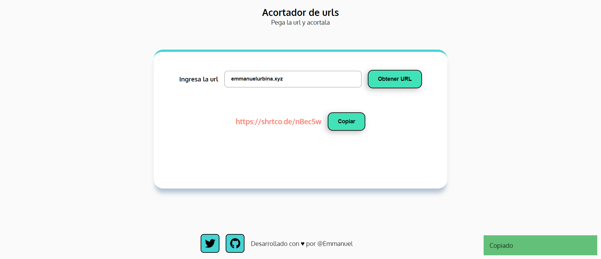

# URL Shortener

This is a web solution to get shorts urls and use in any social network or anywhere you want to use it.

## Table of contents

- [Overview](#overview)
  - [The challenge](#the-challenge)
  - [Screenshot](#screenshot)
  - [Links](#links)
- [My process](#my-process)
  - [Built with](#built-with)
  - [Useful resources](#useful-resources)
- [Author](#author)

## Overview

### The challenge

Users should be able to:

- Put url and get a shortened url

### Screenshot

### Links

- Solution URL: [Github Repo.]()
- Live Site URL: [Live]()

## My process

### Built with

- Semantic HTML5 markup
- CSS custom properties
- Flexbox
- [alertifyjs](https://alertifyjs.com/)
- [API shrtco.de](https://shrtco.de/)
- [Font Awesome](https://fontawesome.com/)

### Useful resources

- [alertifyjs](https://alertifyjs.com/) - Library js to make a great alerts with js
- [API shrtco.de](https://shrtco.de/) - API to get shortened urls
- [Font Awesome](https://fontawesome.com/) - Icons

## Author

- Website - [Emmanuel](http://www.emmanuelurbina.xyz)
- Twitter - [@emmanuelluur](https://www.twitter.com/emmanuelluur)